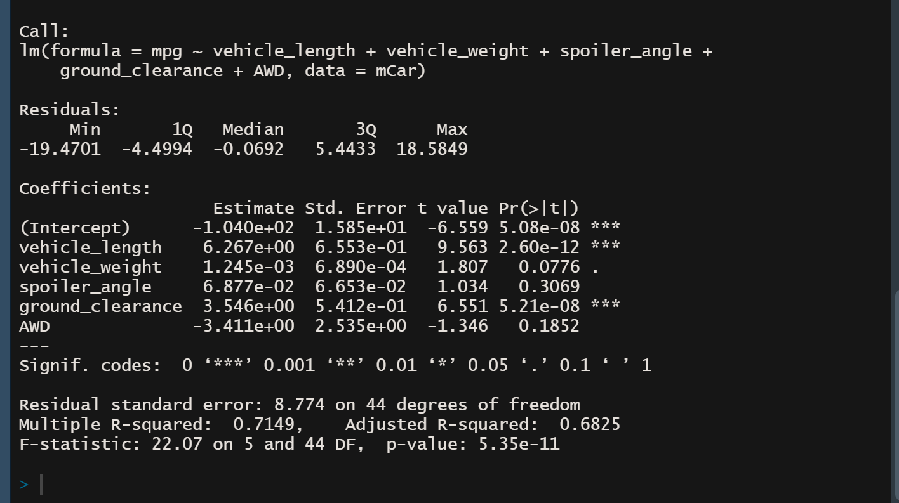
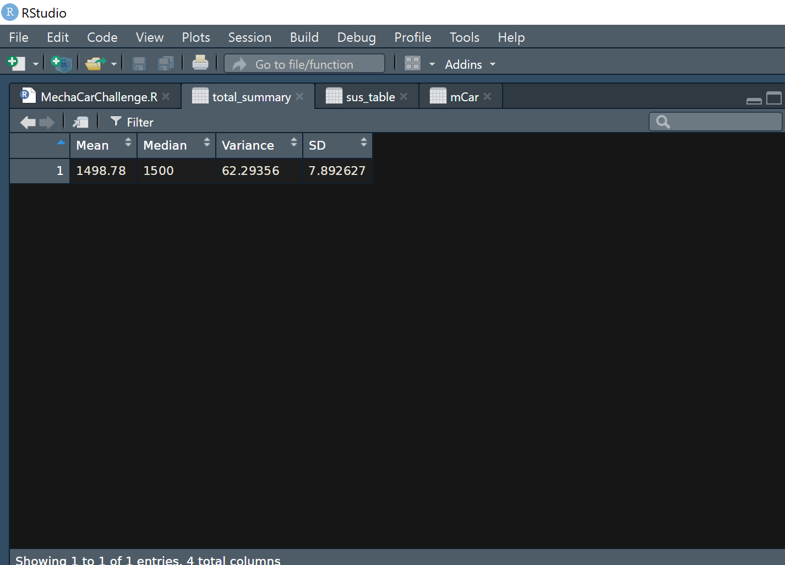
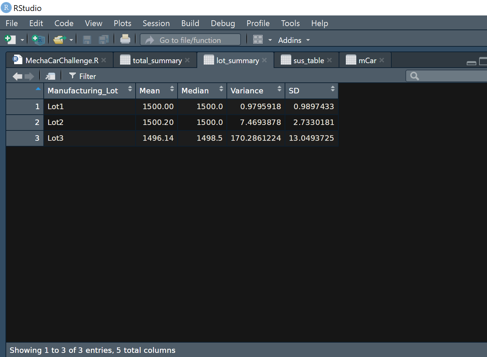
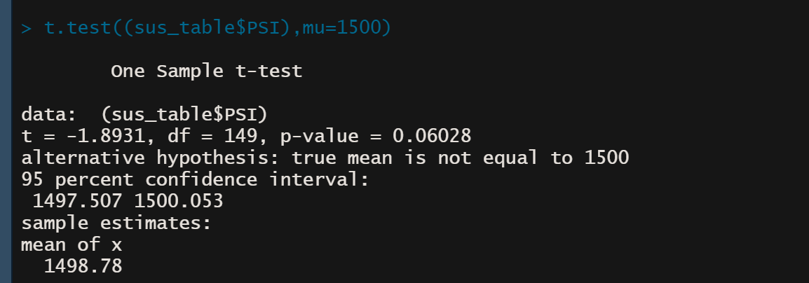
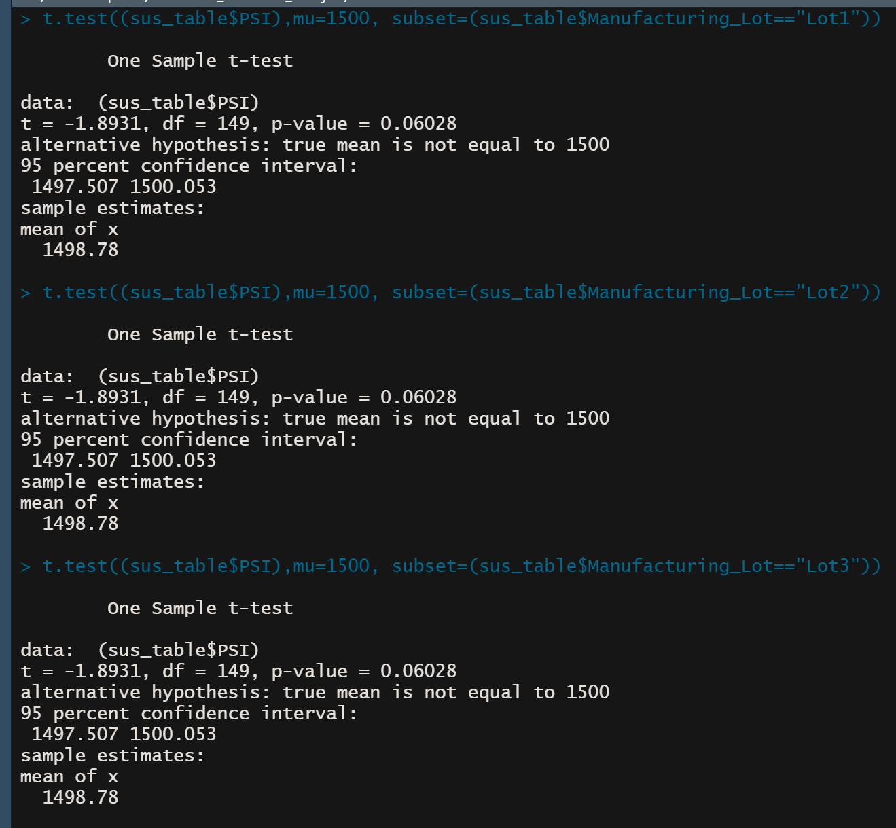

# MechaCar_Statistical_Analysis

## Linear Regression to Predict MPG

Below is a short summary of the output from the linear regression

According to the  results, vehicle_length and ground_clearance (as well as intercept) are statistically likely to provide a non-random amount of variance to the mpg values in the dataset In other words the vehicle_length and ground_clearance have a significant impact on mpg.

The slope of the linear model can not be considered to be zero because the p-value of our linear regression analysis is 5.35 x 10-11, which is much smaller than the significance level

The linear model predicted the mpg of MechaCar effectively because the uses multiple independent variables to account for parts of the total variance observed in the dependent variable.

## Summary Statistics on Suspension Coils

The current manufacturing data for all manufacturing lots in total meet this design specification for for the MechaCar suspension coils dictate that the variance of the suspension coils must not exceed 100 pounds per square inch because the variance for lots in total is 62.29356, which i less than 100. 
The current manufacturing data for each individual lot partially meets this design specification for for the MechaCar suspension coils dictate that the variance of the suspension coils must not exceed 100 pounds per square inch because the variance for lots 1 and 2 are 0.9795918 and 7.4693878, lot 3  on the otherhand has a variance of 170.2861224 which is higher than the maximum limit. 

## T-Tests on Suspension Coils

The PSI across all manufacturing lots is statistically different from the population mean of 1,500 pounds per square inch because The p-value is above the assumed significance level.
The result holds the same for all manufacturing lots and each manufacturing lots.

## Study Design: MechaCar vs Competition
The t-test is used to determine and quantify the performance of the Mechacar against the competition. Using multiple design specifications to identify ideal vehicle performance, the following metrics: vehicle length, vehicle weight, spoiler angle, drivetrain, and ground clearance, were collected for each vehicle to carry out the analysis.

The null hypothesis will be : There is no statistical difference between the two observed sample means.

and, alternative hypothesis will be: There is a statistical difference between the two observed sample means.

I will use the two-sample t-Test because it determines whether the means of two samples are statistically different

To run the statistical analysis, I need the following data:

a. data: numeric vector of data values.

b. mu: a number indicating the true value of the mean (or difference in means if you are performing a two sample test).

c. subset: an optional vector specifying a subset of observations to be used.

